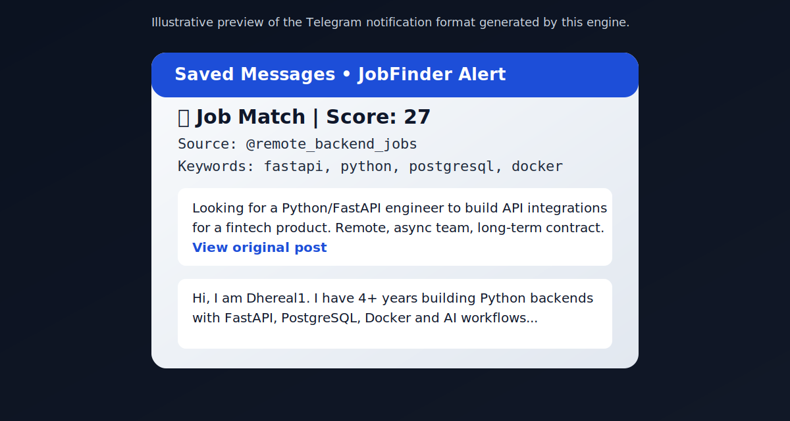

# AI Job Acquisition Engine

A config-driven Telegram job intelligence system for AI/backend engineers.

AI Job Acquisition Engine monitors Telegram channels and RSS feeds, scores opportunities against your profile, and generates response drafts you can manually review before sending.

## Features

- Telegram job listener (`Telethon`)
- RSS ingestion pipeline
- Editable YAML skill matcher
- Relevance scoring engine with configurable weights
- SQLite tracking and status management
- Proposal draft generator (template-based)
- Manual-approval workflow (no auto-spam)
- CLI dashboard + FastAPI review dashboard

## Architecture

```text
Telegram Channels + RSS Feeds
            |
            v
   Listener Layer (Telethon / RSS Poller)
            |
            v
 Matcher (YAML-configurable scoring rules)
            |
            v
      SQLite Storage (jobs.db)
            |
            v
 Notification + Draft Generator
            |
            v
   Review Interfaces (CLI / FastAPI)
```

## Setup

### 1. Install dependencies

```bash
pip install -r requirements.txt
```

### 2. Configure Telegram credentials

Create your credentials file and add `api_id` and `api_hash` from `https://my.telegram.org/apps`.

### 3. Validate Telegram session manually

```python
from telethon.sync import TelegramClient

api_id = 123456
api_hash = "your_api_hash"

client = TelegramClient("session", api_id, api_hash)
client.start()
print(client.get_me())
```

If this succeeds, auth/session setup is correct.

### 4. Initialize local database

```bash
python3 init_db.py
```

### 5. Run collectors

```bash
python3 bot.py
python3 rss_poller.py
```

### 6. Review matched jobs

CLI dashboard:

```bash
python3 dashboard_cli.py --min 14 --status pending --limit 30
```

Web dashboard:

```bash
uvicorn dashboard_web:app --reload
```

Open `http://127.0.0.1:8000`.

## Example Scoring Config

```yaml
thresholds:
  notify: 14
  strong: 22

weights:
  must_have: 6
  nice_to_have: 3
  role_match: 4
  negative: -8

keywords:
  must_have:
    - python
    - fastapi
    - postgresql
  nice_to_have:
    - docker
    - aws
    - llm

negative_keywords:
  - unpaid
  - commission-only
```

## Notification Screenshot



## Roadmap

- [x] Telegram listener
- [x] Config-driven skill matching
- [x] Draft generation (template-based)
- [x] Web dashboard (FastAPI)
- [x] Multi-source support (RSS)
- [ ] Analytics + conversion tracking
- [ ] Team review workflow
- [ ] Hosted SaaS foundation (Postgres + auth)

## Safety

- No auto-apply and no automated unsolicited outreach
- Human review required before sending any response
- Keep credential/session files private (`*.session`, API keys)

## Positioning

Built as a practical foundation for an AI job intelligence product: local-first today, SaaS-ready architecture tomorrow.
